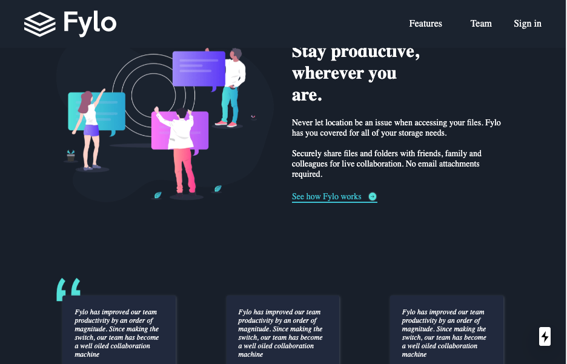
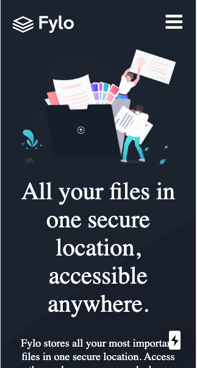

# Next.js-single-page-app
A single page Next.js Application using styled-components for styling
# https://fylo-heroku.herokuapp.com/

## Table of contents
* [General info](#general-info)
* [Screenshots](#screenshots)
* [Technologies](#technologies)
* [Setup](#setup)

# General info
This project is a simple single page app built with Next.js and styled with styled-components. It is built to showcase my design skills and also emphasize my understanding of React, Next.js and styled-components; It is also responsive and adapts to different screen sizes accordingly.

# Screenshots



# Technologies
* Next.js 9.1.7
* React 16.8.6
* styled-components 4.2.0

# Setup
To run this project, install it locally using npm:

```
clone the repository to your computer
$ cd ../clone-location
$ npm install
$ npm run dev
